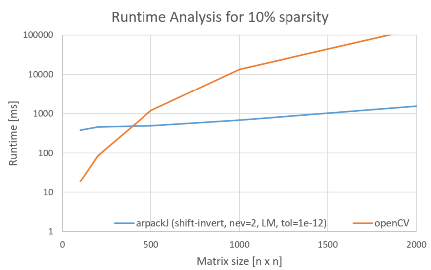

# ArpackJ

ArpackJ is a Java wrapper library for ARPACK and select OpenBLAS functions. It is
designed to provide efficient routines for numerically solving large scale eigenvalue problems and other matrix decompositions
with an interface inspired by SciPy’s scipy.sparse.linalg module.  
While Java provides many libraries for linear algebra, none have become a universally accepted standard, primarily due to
trade-offs between performance and usability due to language limitations. ArpackJ is designed to work with [la4j](https://github.com/vkostyukov/la4j) matrix
types (sparse and dense) but also allows to define matrices functionally via lambda expressions for maximal flexibility.

## Features

- Solve eigenvalue problems for square and symmetric matrices using `eigsh()` (returns real eigenvectors/eigenvalues)
  or non-symmetric matrices using `eigs()` (which returns complex eigenvalues/eigenvectors).
- Solve standard and general eigenvalue problems.
- Support for different modes and options such as shift-invert, buckling or cayley-transform
- LU decomposition
- Matrix inversion (real and complex).

All operations can be performed using the ``Matrix`` type defined by la4j or by defining matrices functionally.
All computations are performed using the **double** data type.

## Getting Started

ArpackJ uses JavaCPP presets [arpack-ng](https://mvnrepository.com/artifact/org.bytedeco/arpack-ng) and [openBLAS](https://mvnrepository.com/artifact/org.bytedeco/openblas)
as backend to perform numerical computations. To use ArpackJ in your project, the easiest way is to build it as a `mavenLocal`
artifact and import it.

1. Clone the ArpackJ repository:
    ```bash
    git clone https://github.com/Daniel63656/ArpackJ.git
    ```

2. Navigate to the project directory and run the publishToMavenLocal gradle task:
    ```bash
    cd ArpackJ
    ./gradlew publishToMavenLocal
    ```
3. In your project’s `build.gradle` file, add the following lines:
    ```gradle
    repositories {
        mavenLocal()
    }
   
    dependencies {
        implementation group: 'net.scoreworks', name: 'ArpackJ', version: '1.0.0'
    }
    ```

## Usage

Matrix decomposition operations are encapsulated in the ``MatrixDecomposition`` class, while the ``MatrixOperations``
class provides utility functions for general matrix operations. These include conversions between different matrix
representations, such as la4j ``Matrix``, flattened arrays, and ``LinearOperation``, as well as matrix inversion functions.  
Below are some examples showcasing common use cases. For additional examples, refer to the test package.
### Solving Eigenvalue problems

To solve an eigenvalue problem, first create an appropriate symmetric (hermetian) or non-symmetric solver instance using one of the
various ``eigs()`` or ``eigsh()`` functions defined in the `MatrixDecomposition` class. For example, to find the 4 largest
magnitude eigenvalues and vectors of a symmetric matrix A:

```java
SymmetricArpackSolver solver = MatrixDecomposition.eigsh(A, 4, "LM", null, 100, 1e-5);
```

After defining the problem, call ``solve()`` on the solver instance. After that, you can query the solution.

```java
solver.solve();
double[] eigenvalues = solver.getEigenvalues();
double[] eigenvectors = solver.getEigenvectors();
```

### Performing LU decomposition using la4j Matrices

```java
double[][] dataB = {    //non-symmetric
        {9, 1, 9, 1, 5},
        {6, 8, 1, 2, 3},
        {3, 1, 7, 5, 1},
        {4, 9, 0, 6, 2},
        {5, 3, 1, 2, 5}};
B = new Basic2DMatrix(dataB);
Matrix res = MatrixDecomposition.LU(B);
```

### Invert matrices

Perform matrix inversion on la4j Matrix:
```java
Matrix B_inv = invert(B);
```

or using matrix in array representation to perform in-place inversion. This variant must be used for complex
matrix inversions:
```java
//3x3 complex matrix (real, imaginary as 2 consecutive double values)
double[] Z = new double[]{
                1,2, 3,4, 5,6,
                1,0, 4,3, 5,6,
                5,6, 1,1, 1,1};
invertComplex(3, Z);    // Perform in-place matrix inversion
```

### LinearOperations

In some cases it can be beneficial to define matrices functionally, as ``LinearOperations``. This type can be used throughout
the library as an alternative to the la4j ``Matrix`` type. ``LinearOperations`` are functional interfaces that represent a matrix
as a left-side multiplication operation on vectors.  
As an example, consider the **sparse** 5x5 matrix with all off-diagonal elements equal to zero:
```math
\begin{bmatrix}
1 &  &  &  &  \\
 & 2 &  &  &  \\
 &  & 3 &  &  \\
 &  &  & 4 &  \\
 &  &  &  & 5
\end{bmatrix}
```

This matrix can be represented as a function, acting on an array ``x``, where ``off`` describes where the target vector starts
in the provided array:
```java
LinearOperation myCustomMatrix = (x, off) -> {
    double[] result = new double[5];
    for (int i=0; i<5; i++) {
        result[i] = x[i+off] * (i+1);
    }
    return result;
};
```

## Runtime analysis

Solving for a few eigenvalues numerically is much faster than solving for all eigenvalues, especially for large and sparse matrices.
For comparison, solving a 2000x2000 matrix for eigenvalues with openCV takes about 2 minutes, where this project can solve for
the largest 2 eigenvalues in about 1 second.  
In most practical scenarios, solving for only the largest or smallest eigenvalue is sufficient. This makes computing all eigenvalues
unnecessary and computationally prohibitive for large matrices.




